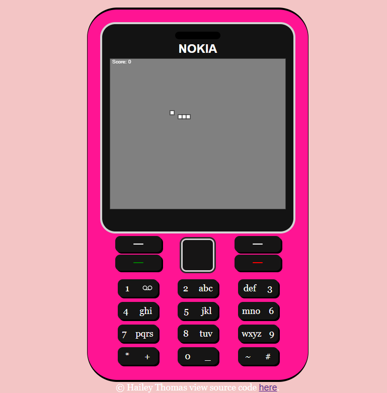

# jQuery Snake Game 📱

## Description

This is a simple snake game powered by Javascript and jQuery. I decided to make a fun nokia phone with css for it to go in.

## Table of Contents

- [Usage](#usage)
- [Credits](#credits)
- [License](#license)

## Usage

Use the arrow keys to move the snake, eat food to increase your size. Game restarts when you either hit yourself or the edge of the game screen.

### Screenshot

### Links

- [DeployedLink](https://haileythomas.github.io/jquery-snake/) - link to deployed website
- [GitHub](https://github.com/HaileyThomas/jquery-snake) - link to GitHub project

## Credits

- [GameTutorial](https://www.sourcecodester.com/tutorials/javascript/11260/creating-very-simple-snake-game-using-jquery.html) - followed this tutorial on how to make the game
- [Ionicons](https://ionic.io/ionicons) - for icons

## License

[License](https://opensource.org/licenses/MIT) - link to license

MIT License

Copyright (c) [2022] [Hailey Thomas]

Permission is hereby granted, free of charge, to any person obtaining a copy
of this software and associated documentation files (the "Software"), to deal
in the Software without restriction, including without limitation the rights
to use, copy, modify, merge, publish, distribute, sublicense, and/or sell
copies of the Software, and to permit persons to whom the Software is
furnished to do so, subject to the following conditions:

The above copyright notice and this permission notice shall be included in all
copies or substantial portions of the Software.

THE SOFTWARE IS PROVIDED "AS IS", WITHOUT WARRANTY OF ANY KIND, EXPRESS OR
IMPLIED, INCLUDING BUT NOT LIMITED TO THE WARRANTIES OF MERCHANTABILITY,
FITNESS FOR A PARTICULAR PURPOSE AND NONINFRINGEMENT. IN NO EVENT SHALL THE
AUTHORS OR COPYRIGHT HOLDERS BE LIABLE FOR ANY CLAIM, DAMAGES OR OTHER
LIABILITY, WHETHER IN AN ACTION OF CONTRACT, TORT OR OTHERWISE, ARISING FROM,
OUT OF OR IN CONNECTION WITH THE SOFTWARE OR THE USE OR OTHER DEALINGS IN THE
SOFTWARE.

## Questions

For any questions, feel free to contact me below.

### Contact

- [Email](mailto:haileyraethomas@gmail.com) - Email Hailey Thomas : haileyraethomas@gmail.com
- [GitHub](https://github.com/HaileyThomas) - GitHub username : HaileyThomas
